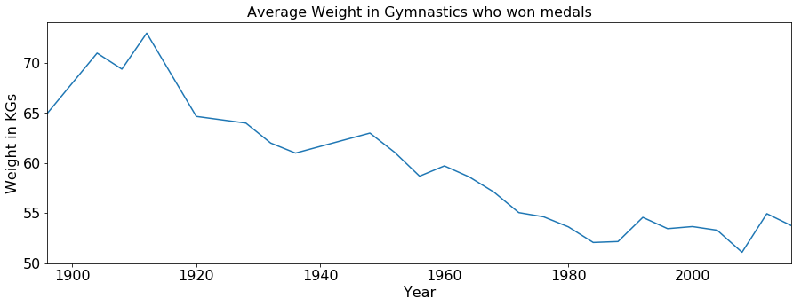

# Importing Required Libraries


```python
import pandas as pd
import matplotlib.pyplot as plt
import seaborn as sns
import numpy as np
```

# Importing data


```python
path1 = '/Users/manoj/Public/university-projects/Final-project/athlete_events.csv'
path2 = '/Users/manoj/Public/university-projects/Final-project/noc_regions.csv'
athlete_data = pd.read_csv(path1)
regions = pd.read_csv(path2)
```

# Overview of athlete events data


```python
# Summary of athlete events data
print('\x1b[1;30mData Columns:\n\x1b[1;34m {}\n'.format(athlete_data.columns.tolist()))
athlete_data.head(5)
```

    Data Columns:
     ['ID', 'Name', 'Sex', 'Age', 'Height', 'Weight', 'Team', 'NOC', 'Games', 'Year', 'Season', 'City', 'Sport', 'Event', 'Medal']
    


<div>
<style scoped>
    .dataframe tbody tr th:only-of-type {
        vertical-align: middle;
    }

    .dataframe tbody tr th {
        vertical-align: top;
    }

    .dataframe thead th {
        text-align: right;
    }
</style>
<table border="1" class="dataframe">
  <thead>
    <tr style="text-align: right;">
      <th></th>
      <th>ID</th>
      <th>Name</th>
      <th>Sex</th>
      <th>Age</th>
      <th>Height</th>
      <th>Weight</th>
      <th>Team</th>
      <th>NOC</th>
      <th>Games</th>
      <th>Year</th>
      <th>Season</th>
      <th>City</th>
      <th>Sport</th>
      <th>Event</th>
      <th>Medal</th>
    </tr>
  </thead>
  <tbody>
    <tr>
      <th>0</th>
      <td>1</td>
      <td>A Dijiang</td>
      <td>M</td>
      <td>24.0</td>
      <td>180.0</td>
      <td>80.0</td>
      <td>China</td>
      <td>CHN</td>
      <td>1992 Summer</td>
      <td>1992</td>
      <td>Summer</td>
      <td>Barcelona</td>
      <td>Basketball</td>
      <td>Basketball Men's Basketball</td>
      <td>NaN</td>
    </tr>
    <tr>
      <th>1</th>
      <td>2</td>
      <td>A Lamusi</td>
      <td>M</td>
      <td>23.0</td>
      <td>170.0</td>
      <td>60.0</td>
      <td>China</td>
      <td>CHN</td>
      <td>2012 Summer</td>
      <td>2012</td>
      <td>Summer</td>
      <td>London</td>
      <td>Judo</td>
      <td>Judo Men's Extra-Lightweight</td>
      <td>NaN</td>
    </tr>
    <tr>
      <th>2</th>
      <td>3</td>
      <td>Gunnar Nielsen Aaby</td>
      <td>M</td>
      <td>24.0</td>
      <td>NaN</td>
      <td>NaN</td>
      <td>Denmark</td>
      <td>DEN</td>
      <td>1920 Summer</td>
      <td>1920</td>
      <td>Summer</td>
      <td>Antwerpen</td>
      <td>Football</td>
      <td>Football Men's Football</td>
      <td>NaN</td>
    </tr>
    <tr>
      <th>3</th>
      <td>4</td>
      <td>Edgar Lindenau Aabye</td>
      <td>M</td>
      <td>34.0</td>
      <td>NaN</td>
      <td>NaN</td>
      <td>Denmark/Sweden</td>
      <td>DEN</td>
      <td>1900 Summer</td>
      <td>1900</td>
      <td>Summer</td>
      <td>Paris</td>
      <td>Tug-Of-War</td>
      <td>Tug-Of-War Men's Tug-Of-War</td>
      <td>Gold</td>
    </tr>
    <tr>
      <th>4</th>
      <td>5</td>
      <td>Christine Jacoba Aaftink</td>
      <td>F</td>
      <td>21.0</td>
      <td>185.0</td>
      <td>82.0</td>
      <td>Netherlands</td>
      <td>NED</td>
      <td>1988 Winter</td>
      <td>1988</td>
      <td>Winter</td>
      <td>Calgary</td>
      <td>Speed Skating</td>
      <td>Speed Skating Women's 500 metres</td>
      <td>NaN</td>
    </tr>
  </tbody>
</table>
</div>


We can see there are NaN values in the data lets find which all data is missing.<br>
we should be considering not null values of Age, Weight, Height and Medals while analysis to avoid issues.


```python
athlete_data.isnull().sum()
```


    ID             0
    Name           0
    Sex            0
    Age         9474
    Height     60171
    Weight     62875
    Team           0
    NOC            0
    Games          0
    Year           0
    Season         0
    City           0
    Sport          0
    Event          0
    Medal     231333
    dtype: int64


# Overview on Region Codes Data


```python
# Summary of NOC regions data
print('\x1b[1;30mData Columns:\n\x1b[1;34m {}\n'.format(regions.columns.tolist()))
regions.head(5)
```

    Data Columns:
     ['NOC', 'region', 'notes']
    


<div>
<style scoped>
    .dataframe tbody tr th:only-of-type {
        vertical-align: middle;
    }

    .dataframe tbody tr th {
        vertical-align: top;
    }

    .dataframe thead th {
        text-align: right;
    }
</style>
<table border="1" class="dataframe">
  <thead>
    <tr style="text-align: right;">
      <th></th>
      <th>NOC</th>
      <th>region</th>
      <th>notes</th>
    </tr>
  </thead>
  <tbody>
    <tr>
      <th>0</th>
      <td>AFG</td>
      <td>Afghanistan</td>
      <td>NaN</td>
    </tr>
    <tr>
      <th>1</th>
      <td>AHO</td>
      <td>Curacao</td>
      <td>Netherlands Antilles</td>
    </tr>
    <tr>
      <th>2</th>
      <td>ALB</td>
      <td>Albania</td>
      <td>NaN</td>
    </tr>
    <tr>
      <th>3</th>
      <td>ALG</td>
      <td>Algeria</td>
      <td>NaN</td>
    </tr>
    <tr>
      <th>4</th>
      <td>AND</td>
      <td>Andorra</td>
      <td>NaN</td>
    </tr>
  </tbody>
</table>
</div>


# Data Preparation


```python
# Data Preparation by merging the Athletes data and NOC data using pandas merge. 
data = pd.merge(athlete_data, regions, on='NOC', how='left')
data.head(5)
```


<div>
<style scoped>
    .dataframe tbody tr th:only-of-type {
        vertical-align: middle;
    }

    .dataframe tbody tr th {
        vertical-align: top;
    }

    .dataframe thead th {
        text-align: right;
    }
</style>
<table border="1" class="dataframe">
  <thead>
    <tr style="text-align: right;">
      <th></th>
      <th>ID</th>
      <th>Name</th>
      <th>Sex</th>
      <th>Age</th>
      <th>Height</th>
      <th>Weight</th>
      <th>Team</th>
      <th>NOC</th>
      <th>Games</th>
      <th>Year</th>
      <th>Season</th>
      <th>City</th>
      <th>Sport</th>
      <th>Event</th>
      <th>Medal</th>
      <th>region</th>
      <th>notes</th>
    </tr>
  </thead>
  <tbody>
    <tr>
      <th>0</th>
      <td>1</td>
      <td>A Dijiang</td>
      <td>M</td>
      <td>24.0</td>
      <td>180.0</td>
      <td>80.0</td>
      <td>China</td>
      <td>CHN</td>
      <td>1992 Summer</td>
      <td>1992</td>
      <td>Summer</td>
      <td>Barcelona</td>
      <td>Basketball</td>
      <td>Basketball Men's Basketball</td>
      <td>NaN</td>
      <td>China</td>
      <td>NaN</td>
    </tr>
    <tr>
      <th>1</th>
      <td>2</td>
      <td>A Lamusi</td>
      <td>M</td>
      <td>23.0</td>
      <td>170.0</td>
      <td>60.0</td>
      <td>China</td>
      <td>CHN</td>
      <td>2012 Summer</td>
      <td>2012</td>
      <td>Summer</td>
      <td>London</td>
      <td>Judo</td>
      <td>Judo Men's Extra-Lightweight</td>
      <td>NaN</td>
      <td>China</td>
      <td>NaN</td>
    </tr>
    <tr>
      <th>2</th>
      <td>3</td>
      <td>Gunnar Nielsen Aaby</td>
      <td>M</td>
      <td>24.0</td>
      <td>NaN</td>
      <td>NaN</td>
      <td>Denmark</td>
      <td>DEN</td>
      <td>1920 Summer</td>
      <td>1920</td>
      <td>Summer</td>
      <td>Antwerpen</td>
      <td>Football</td>
      <td>Football Men's Football</td>
      <td>NaN</td>
      <td>Denmark</td>
      <td>NaN</td>
    </tr>
    <tr>
      <th>3</th>
      <td>4</td>
      <td>Edgar Lindenau Aabye</td>
      <td>M</td>
      <td>34.0</td>
      <td>NaN</td>
      <td>NaN</td>
      <td>Denmark/Sweden</td>
      <td>DEN</td>
      <td>1900 Summer</td>
      <td>1900</td>
      <td>Summer</td>
      <td>Paris</td>
      <td>Tug-Of-War</td>
      <td>Tug-Of-War Men's Tug-Of-War</td>
      <td>Gold</td>
      <td>Denmark</td>
      <td>NaN</td>
    </tr>
    <tr>
      <th>4</th>
      <td>5</td>
      <td>Christine Jacoba Aaftink</td>
      <td>F</td>
      <td>21.0</td>
      <td>185.0</td>
      <td>82.0</td>
      <td>Netherlands</td>
      <td>NED</td>
      <td>1988 Winter</td>
      <td>1988</td>
      <td>Winter</td>
      <td>Calgary</td>
      <td>Speed Skating</td>
      <td>Speed Skating Women's 500 metres</td>
      <td>NaN</td>
      <td>Netherlands</td>
      <td>NaN</td>
    </tr>
  </tbody>
</table>
</div>


# Data Analysis based on Gender and Age


```python
# Summary of Atheltes praticipated catagorized by Gender
gender_data = data['Sex'].value_counts()
labels = ['Male', 'Female']
plt.figure(figsize=(7, 7))
plt.pie(gender_data, labels=labels, autopct='%1.0f%%')
plt.title('Sex Ratio of Participants')
plt.legend(labels)
plt.show()
```


```python
# Summary of Athletes winning medals catagorized by Age

medal_data = data[data.Medal.notnull()]
medals = medal_data[np.isfinite(medal_data['Age'])]
plt.figure(figsize=(70, 50))
sns.catplot(x='Age', y='Medal', data=medals, hue='Medal')
plt.show()
```


    <Figure size 5040x3600 with 0 Axes>


**It is pretty interesting that there are Athletes who are older than 60 years winning Medals.**

**Let's get deeper into Athletes with age>60**


```python
# It is pretty interesting that there are Athletes who are older than 60 years winning Medals
# Let's get deeper into Athletes with age>60

sports_over_60 = medals['Sport'][medals['Age'] > 60]
print('\x1b[1;30mSports Played By Athletes with Age>60.\n\x1b[1;34m {}\n'.format(sports_over_60.unique()))
```

    Sports Played By Athletes with Age>60.
     ['Shooting' 'Art Competitions' 'Archery' 'Roque' 'Sailing' 'Equestrianism']
    


```python
# Let's get deeper into Athletes with age>60 by Gender
female_sports_over_60 = medals['Sport'][medals['Age'] > 60][medals['Sex'] == 'F']
print('\x1b[1;30mSports Played By Female Athletes with Age>60.\n\x1b[1;34m {}\n'.format(female_sports_over_60.unique())) 


male_sports_over_60 = medals['Sport'][medals['Age'] > 60][medals['Sex'] == 'M']
print('\x1b[1;30mSports Played By Male Athletes with Age>60.\n\x1b[1;34m {}\n'.format(male_sports_over_60.unique()))
```

    Sports Played By Female Athletes with Age>60.
     ['Art Competitions' 'Archery']
    
    Sports Played By Male Athletes with Age>60.
     ['Shooting' 'Art Competitions' 'Archery' 'Roque' 'Sailing' 'Equestrianism']
    


**It is clear that all the sports with winning atheltes older than 60 are about having keen eye sight.**

## Let's get the youngest and oldest winning Athletes


```python
print('## Youngest Athlete in olympics who won medal')
print(medals.loc[medals['Age'].idxmin()])
```

    ## Youngest Athlete in olympics who won medal
    ID                                        71691
    Name                         Dimitrios Loundras
    Sex                                           M
    Age                                          10
    Height                                      NaN
    Weight                                      NaN
    Team              Ethnikos Gymnastikos Syllogos
    NOC                                         GRE
    Games                               1896 Summer
    Year                                       1896
    Season                                   Summer
    City                                     Athina
    Sport                                Gymnastics
    Event     Gymnastics Men's Parallel Bars, Teams
    Medal                                    Bronze
    region                                   Greece
    notes                                       NaN
    Name: 142882, dtype: object


```python
print('## Oldest Athlete in olympics who won medal')
print(medals.loc[medals['Age'].idxmax()])
```

    ## Oldest Athlete in olympics who won medal
    ID                                                22984
    Name      John (Herbert Crawford-) Copley (Williamson-)
    Sex                                                   M
    Age                                                  73
    Height                                              NaN
    Weight                                              NaN
    Team                                      Great Britain
    NOC                                                 GBR
    Games                                       1948 Summer
    Year                                               1948
    Season                                           Summer
    City                                             London
    Sport                                  Art Competitions
    Event     Art Competitions Mixed Painting, Graphic Arts
    Medal                                            Silver
    region                                               UK
    notes                                               NaN
    Name: 44584, dtype: object


```python
top_sports = data.Sport.value_counts().nlargest(15)
top_sports.plot(kind='Bar',width=0.8, figsize=(40, 20),fontsize=24, color='teal')
plt.title('Top sports based on number of Athelets participated',fontsize=36, fontweight='bold')
plt.xlabel('Name of the Sport', fontsize=36, fontweight='bold')
plt.ylabel('Number of Athletes', fontsize=36, fontweight='bold')
plt.show()
```


# Data Analysis based on the Weight and Height

## Athletes Weight Data Analysis


```python
# Since we know there is data with no value for Weight lets take only finite valued data and see the trend over years
weight_data = data[np.isfinite(data['Weight'])]
mean_weight = (weight_data.groupby('Year')['Weight'].mean())
mean_weight.plot(figsize=(15, 5),fontsize=16)
plt.title('Average Weight in Olympics', fontsize=16)
plt.ylabel('Weight in KGs', fontsize=16)
plt.xlabel('Year',fontsize=16)
plt.show()
```


## Athletes Height Data Analysis


```python
# Since we know there is data with no value for Weight lets take only finite valued data and see the trend over years
height_data = data[np.isfinite(data['Height'])]
mean_height = (height_data.groupby('Year')['Height'].mean())
mean_height.plot(figsize=(15, 5),fontsize=16)
plt.title('Average Height in Olympics', fontsize=16)
plt.ylabel('Height in cms', fontsize=16)
plt.xlabel('Year',fontsize=16)
plt.show()
```


```python
gymnastics = weight_data[weight_data['Sport'] == 'Gymnastics']
gymnastics_medals = gymnastics[gymnastics.Medal.notnull()]
mean_gymnastics_weights = gymnastics_medals.groupby('Year')['Weight'].mean()
mean_gymnastics_weights.plot(figsize=(15, 5),fontsize=16)
plt.title('Average Weight in Gymnastics who won medals', fontsize=16)
plt.ylabel('Weight in KGs', fontsize=16)
plt.xlabel('Year',fontsize=16)
plt.show()
gymnastics = height_data[height_data['Sport'] == 'Gymnastics']
gymnastics_medals = gymnastics[gymnastics.Medal.notnull()]
mean_gymnastics_heights = gymnastics_medals.groupby('Year')['Height'].mean()
mean_gymnastics_heights.plot(figsize=(15, 5),fontsize=16)
plt.title('Average height in Gymnastics who won medals', fontsize=16)
plt.ylabel('Height in cms', fontsize=16)
plt.xlabel('Year',fontsize=16)
plt.show()
```





```python
skiing = weight_data[weight_data['Sport'] == 'Alpine Skiing']
skiing_medals = skiing[skiing.Medal.notnull()]
mean_skiing_weights = skiing_medals.groupby('Year')['Weight'].mean()
mean_skiing_weights.plot(figsize=(15, 5),fontsize=16)
plt.title('Average Weight of Skiing won medals', fontsize=16)
plt.ylabel('Weight in KGs', fontsize=16)
plt.xlabel('Year',fontsize=16)
plt.show()
skiing = height_data[height_data['Sport'] == 'Alpine Skiing']
skiing_medals = skiing[skiing.Medal.notnull()]
mean_skiing_heights = skiing_medals.groupby('Year')['Height'].mean()
mean_skiing_heights.plot(figsize=(15, 5),fontsize=16)
plt.title('Average Height of Skiing won medals', fontsize=16)
plt.ylabel('Height in cms', fontsize=16)
plt.xlabel('Year',fontsize=16)
plt.show()
```


**We can see that the Weight and Height of Skiing Atheletes who won the medals increased while Weight and Height of Gymnastics Atheletes who won the medals this is because gymnastics need less weight and height to achive good balance while skiing needs more height and weight to reach more distance and increase speed**


```python
top_teams = data.Team.value_counts().nlargest(30)
print(top_teams[:10])
```

    United States    17847
    France           11988
    Great Britain    11404
    Italy            10260
    Germany           9326
    Canada            9279
    Japan             8289
    Sweden            8052
    Australia         7513
    Hungary           6547
    Name: Team, dtype: int64


```python
top_teams_medal_count = medal_data.Team.value_counts().nlargest(30)
print(top_teams_medal_count[:10])
```

    United States    5219
    Soviet Union     2451
    Germany          1984
    Great Britain    1673
    France           1550
    Italy            1527
    Sweden           1434
    Australia        1306
    Canada           1243
    Hungary          1127
    Name: Team, dtype: int64


```python
dataf = pd.DataFrame({'Participants': top_teams, 'Medals' : top_teams_medal_count})
dataf = dataf.dropna().sort_values(by='Participants', ascending=False)
dataf.plot(kind='bar',width=0.8, figsize=(40, 20),fontsize=24)
plt.title('Top Teams based on number of Medals and Participants',fontsize=36, fontweight='bold')
plt.xlabel('Name of the Team', fontsize=36, fontweight='bold')
plt.ylabel('Number of Medals', fontsize=36, fontweight='bold')
plt.legend(fontsize=36)
plt.show()
```


```python
medal_ratio = (top_teams_medal_count.div(top_teams)).mul(100).sort_values(ascending=False)
medal_ratio = medal_ratio.dropna()
medal_ratio.plot(kind='Bar',width=0.8, figsize=(40, 20),fontsize=24, color='green')
plt.title('Percentage of winning medals over participation by Team',fontsize=36, fontweight='bold')
plt.xlabel('Name of the Team', fontsize=36, fontweight='bold')
plt.ylabel('% Percentage of Medals Won', fontsize=36, fontweight='bold')
plt.show()
```


```python
gold_medals = data[data.Medal == 'Gold']
top_teams_gold_medal = gold_medals.Team.value_counts().nlargest(30)
dataf = pd.DataFrame({'Participants': top_teams, 'Gold Medals' : top_teams_gold_medal})
dataf = dataf.dropna().sort_values(by='Participants', ascending=False)
dataf.plot(kind='bar',width=0.8, figsize=(40, 20),fontsize=24, color=['blue', 'gold'])
plt.title('Top Teams based on number of Medals and Participants',fontsize=36, fontweight='bold')
plt.xlabel('Name of the Team', fontsize=36, fontweight='bold')
plt.ylabel('Number of Gold Medals', fontsize=36, fontweight='bold')
plt.legend(fontsize=36)
plt.show()
```


```python
gold_medal_ratio = (top_teams_gold_medal.div(top_teams)).mul(100).sort_values(ascending=False)
gold_medal_ratio = gold_medal_ratio.dropna()
gold_medal_ratio.plot(kind='Bar',width=0.8, figsize=(40, 20),fontsize=24, color='gold')
plt.title('Percentage of winning gold medals over participation by Team',fontsize=36, fontweight='bold')
plt.xlabel('Name of the Team', fontsize=36, fontweight='bold')
plt.ylabel('% Percentage of Gold Medals Won', fontsize=36, fontweight='bold')
plt.show()
```


```python
silver_medals = data[data.Medal == 'Silver']
top_teams_silver_medal = silver_medals.Team.value_counts().nlargest(30)
dataf = pd.DataFrame({'Participants': top_teams, 'Silver Medals' : top_teams_silver_medal})
dataf = dataf.dropna().sort_values(by='Participants', ascending=False)
dataf.plot(kind='bar',width=0.8, figsize=(40, 20),fontsize=24, color=['blue', 'grey'])
plt.title('Top Teams based on number of Medals and Participants',fontsize=36, fontweight='bold')
plt.xlabel('Name of the Team', fontsize=36, fontweight='bold')
plt.ylabel('Number of Silver Medals', fontsize=36, fontweight='bold')
plt.legend(fontsize=36)
plt.show()
```


```python
silver_medal_ratio = (top_teams_silver_medal.div(top_teams)).mul(100).sort_values(ascending=False)
silver_medal_ratio = silver_medal_ratio.dropna()
silver_medal_ratio.plot(kind='Bar',width=0.8, figsize=(40, 20),fontsize=24, color='grey')
plt.title('Percentage of winning silver medals over participation by Team',fontsize=36, fontweight='bold')
plt.xlabel('Name of the Team', fontsize=36, fontweight='bold')
plt.ylabel('% Percentage of silver Medals Won', fontsize=36, fontweight='bold')
plt.show()
```


```python
bronze_medals = data[data.Medal == 'Bronze']
top_teams_bronze_medal = bronze_medals.Team.value_counts().nlargest(30)
dataf = pd.DataFrame({'Participants': top_teams, 'Bronze Medals' : top_teams_bronze_medal})
dataf = dataf.dropna().sort_values(by='Participants', ascending=False)
dataf.plot(kind='bar',width=0.8, figsize=(40, 20),fontsize=24, color=['blue', 'chocolate'])
plt.title('Top Teams based on number of Medals and Participants',fontsize=36, fontweight='bold')
plt.xlabel('Name of the Team', fontsize=36, fontweight='bold')
plt.ylabel('Number of Silver Medals', fontsize=36, fontweight='bold')
plt.legend(fontsize=36)
plt.show()
```


```python
bronze_medal_ratio = (top_teams_bronze_medal.div(top_teams)).mul(100).sort_values(ascending=False)
bronze_medal_ratio = bronze_medal_ratio.dropna()
bronze_medal_ratio.plot(kind='Bar',width=0.8, figsize=(40, 20),fontsize=24, color='chocolate')
plt.title('Percentage of winning bronze medals over participation by Team',fontsize=36, fontweight='bold')
plt.xlabel('Name of the Team', fontsize=36, fontweight='bold')
plt.ylabel('% Percentage of Bronze Medals Won', fontsize=36, fontweight='bold')
plt.show()
```


```python

```
